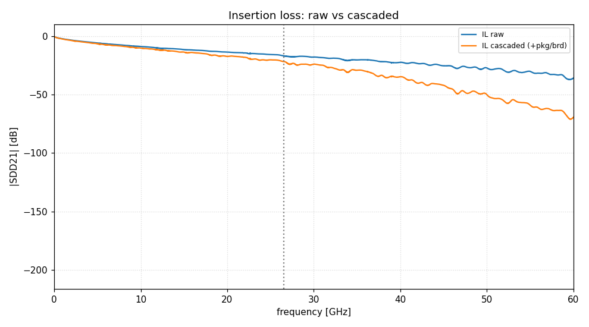
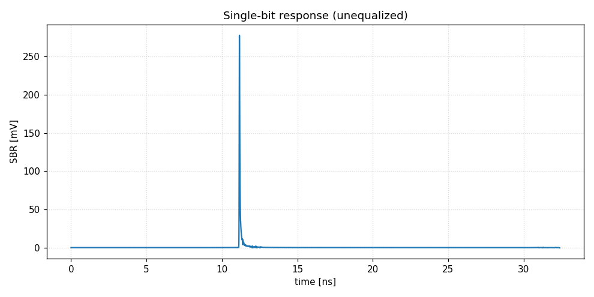
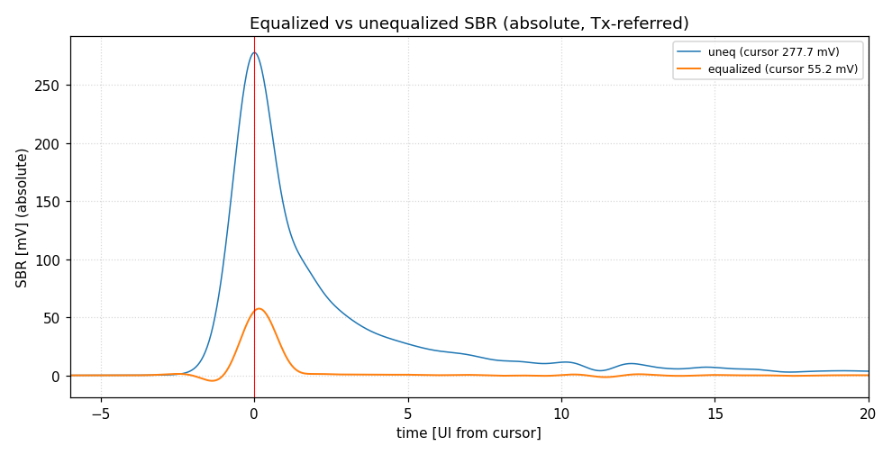
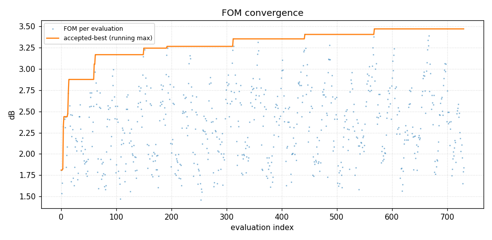
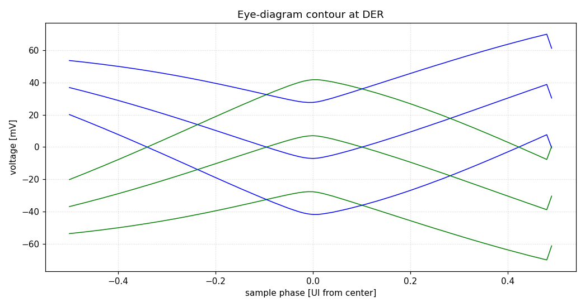
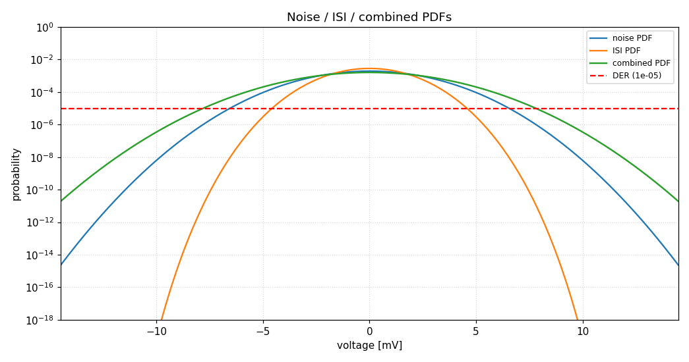
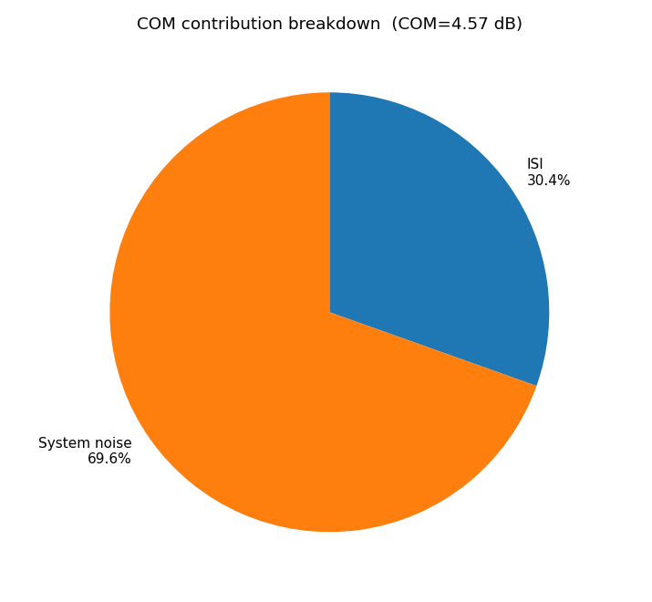
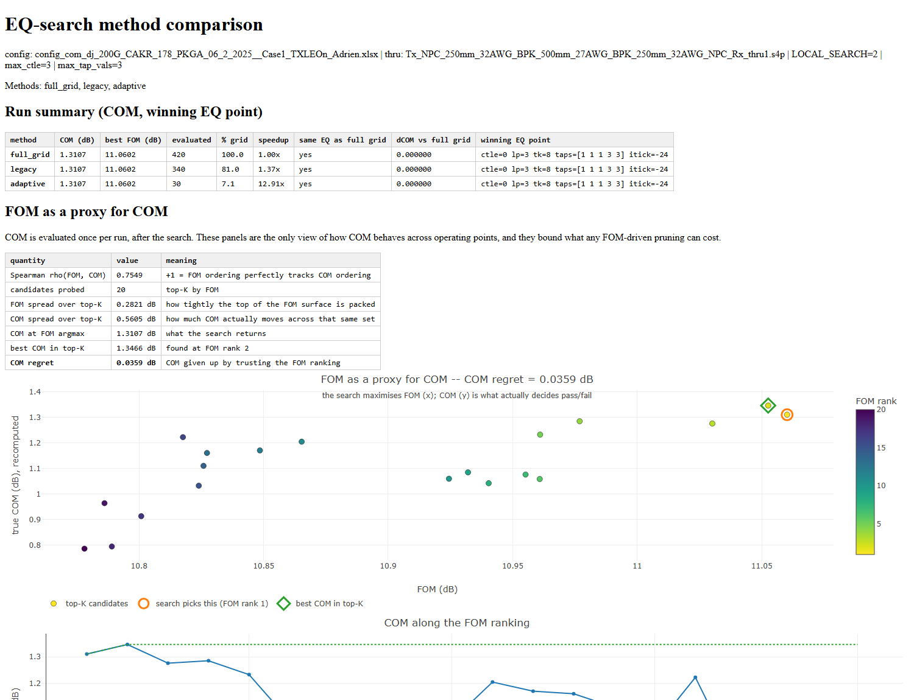
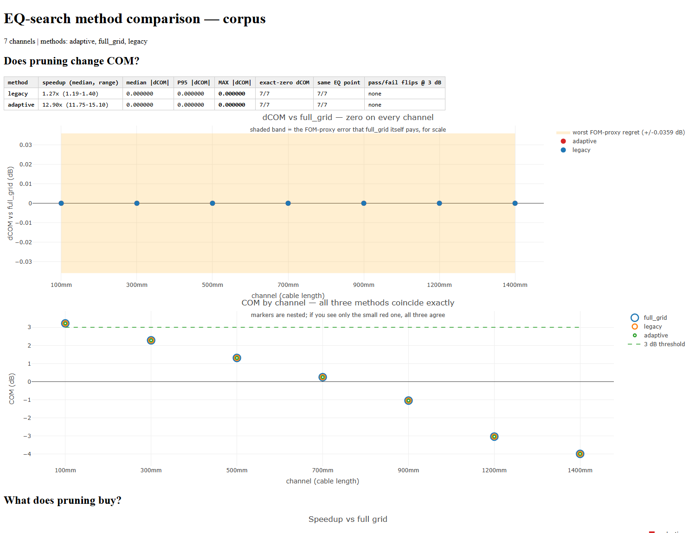

# SiCoPR — Channel Operating Margin in Python

*(pronounced si-copper) — Si (Signal Integrity), Co (COM), P (Python), and R*

A complete tutorial and reference for the Python port of the IEEE 802.3 COM
(Channel Operating Margin) MATLAB reference tool: the engine, its configuration
surface, the equalizer-search study layer, the R reporting tools, and the
reference code itself running under GNU Octave.

| | |
|---|---|
| version | 2.0, 20 September 2026 |
| emulates | `com_ieee8023_4p16p0.m` by default, `4p15p0` behind a version switch |
| the engine | `python -m sicopr` |
| to run something now | [`examples/`](../examples/) — one download, one command |

> **What is in version 2.0**
>
> Chapter 12 covers the reference code running under GNU Octave from this
> repository, which is the way to check this port against the reference without
> a MATLAB licence. Chapter 11 carries the 1368-case comparison (re-run
> 2026-09-26), and chapter 2 starts with the worked example in `examples/`.

> **A note on trust**
>
> COM is a pass/fail criterion. Chapter 11 states plainly what has and has not
> been verified in this implementation. Read it before relying on a number in a
> submission.

## Contents

- [1 Introduction](#1-introduction)
  - [1.1 What this is](#11-what-this-is)
  - [1.2 What it adds beyond the MATLAB tool](#12-what-it-adds-beyond-the-matlab-tool)
  - [1.3 How to read this document](#13-how-to-read-this-document)
- [2 Installation and first run](#2-installation-and-first-run)
  - [2.1 Requirements](#21-requirements)
  - [2.2 What ships, and what does not](#22-what-ships-and-what-does-not)
  - [2.3 Running COM](#23-running-com)
    - [The worked example, by hand](#the-worked-example-by-hand)
    - [Reading the progress lines](#reading-the-progress-lines)
  - [2.4 Where output goes](#24-where-output-goes)
- [3 Architecture](#3-architecture)
  - [3.1 The assembly model](#31-the-assembly-model)
  - [3.2 Dependency injection](#32-dependency-injection)
  - [3.3 Search instrumentation](#33-search-instrumentation)
  - [3.4 Modules that sit beside the engine](#34-modules-that-sit-beside-the-engine)
  - [3.5 Repository layout](#35-repository-layout)
- [4 Inputs](#4-inputs)
  - [4.1 The configuration spreadsheet](#41-the-configuration-spreadsheet)
  - [4.2 S-parameter files](#42-s-parameter-files)
  - [4.3 Package cases](#43-package-cases)
- [5 Configuration: the parameters that matter](#5-configuration-the-parameters-that-matter)
  - [5.1 Signalling and test limits](#51-signalling-and-test-limits)
  - [5.2 Equalizer sweeps](#52-equalizer-sweeps)
  - [5.3 Noise, jitter and crosstalk](#53-noise-jitter-and-crosstalk)
  - [5.4 Package, die and termination](#54-package-die-and-termination)
  - [5.5 Output flags](#55-output-flags)
- [6 Feature reference](#6-feature-reference)
  - [6.1 Transmit FFE](#61-transmit-ffe)
  - [6.2 CTLE](#62-ctle)
  - [6.3 Decision feedback equalization](#63-decision-feedback-equalization)
  - [6.4 Receive FFE (MMSE)](#64-receive-ffe-mmse)
  - [6.5 MLSE](#65-mlse)
  - [6.6 Crosstalk](#66-crosstalk)
  - [6.7 ERL and TDR](#67-erl-and-tdr)
  - [6.8 Frequency-domain metrics](#68-frequency-domain-metrics)
  - [6.9 Receiver calibration](#69-receiver-calibration)
  - [6.10 C2M: VEO and VEC](#610-c2m-veo-and-vec)
  - [6.11 Error propagation](#611-error-propagation)
- [7 Outputs](#7-outputs)
  - [7.1 The result block](#71-the-result-block)
  - [7.2 results.csv](#72-resultscsv)
  - [7.3 Figures](#73-figures)
  - [7.4 Engineering .mat export](#74-engineering-mat-export)
- [8 The equalizer-search study](#8-the-equalizer-search-study)
  - [8.1 Three search methods](#81-three-search-methods)
  - [8.2 Why FOM is not the whole story](#82-why-fom-is-not-the-whole-story)
  - [8.3 Comparing methods on one channel](#83-comparing-methods-on-one-channel)
  - [8.4 Recomputing true COM near the optimum](#84-recomputing-true-com-near-the-optimum)
  - [8.5 Running a corpus](#85-running-a-corpus)
    - [What it reports](#what-it-reports)
  - [8.6 Results to date](#86-results-to-date)
    - [The proxy measurement](#the-proxy-measurement)
  - [8.7 Diagnosing history dependence](#87-diagnosing-history-dependence)
- [9 The R reporting layer](#9-the-r-reporting-layer)
  - [9.1 Single-run engineering dashboard](#91-single-run-engineering-dashboard)
  - [9.2 Single-channel search comparison](#92-single-channel-search-comparison)
  - [9.3 Corpus report](#93-corpus-report)
  - [9.4 Building the review deck](#94-building-the-review-deck)
- [10 Development workflow](#10-development-workflow)
  - [10.1 Changing behaviour](#101-changing-behaviour)
  - [10.2 The test suites](#102-the-test-suites)
  - [10.3 Conventions worth knowing](#103-conventions-worth-knowing)
- [11 Verification status and limitations](#11-verification-status-and-limitations)
  - [11.1 What has been verified](#111-what-has-been-verified)
  - [11.2 Limitations](#112-limitations)
- [12 The reference code under GNU Octave](#12-the-reference-code-under-gnu-octave)
  - [12.1 What is in octave/](#121-what-is-in-octave)
  - [12.2 Running a case](#122-running-a-case)
  - [12.3 Two defects in Octave worth knowing about](#123-two-defects-in-octave-worth-knowing-about)
  - [12.4 The optional compiled build](#124-the-optional-compiled-build)
  - [12.5 How fast, and how close](#125-how-fast-and-how-close)
- [Appendix A COM concepts](#appendix-a-com-concepts)
  - [A.1 What COM measures](#a1-what-com-measures)
  - [A.2 The equalizer chain](#a2-the-equalizer-chain)
  - [A.3 FOM versus COM](#a3-fom-versus-com)
  - [A.4 Reading a result](#a4-reading-a-result)
- [Appendix B Complete configuration parameter index](#appendix-b-complete-configuration-parameter-index)
  - [Signalling & test limits (23)](#signalling--test-limits-23)
  - [EQ search control (5)](#eq-search-control-5)
  - [Equalization — TX FFE (12)](#equalization--tx-ffe-12)
  - [Equalization — CTLE (14)](#equalization--ctle-14)
  - [Equalization — DFE & MLSE (14)](#equalization--dfe--mlse-14)
  - [Equalization — RX FFE (10)](#equalization--rx-ffe-10)
  - [Receiver filter & windowing (11)](#receiver-filter--windowing-11)
  - [Noise, jitter & crosstalk (19)](#noise-jitter--crosstalk-19)
  - [Package, die & termination (30)](#package-die--termination-30)
  - [Channel / S-parameter handling (16)](#channel--s-parameter-handling-16)
  - [Frequency-domain metrics (ILD/ICN) (8)](#frequency-domain-metrics-ildicn-8)
  - [ERL / TDR / reflection (14)](#erl--tdr--reflection-14)
  - [Statistical / PDF construction (16)](#statistical--pdf-construction-16)
  - [Error propagation (3)](#error-propagation-3)
  - [RX calibration (4)](#rx-calibration-4)
  - [Skew (5)](#skew-5)
  - [Output, reporting & execution (28)](#output-reporting--execution-28)
  - [Other / advanced (15)](#other--advanced-15)
- [Appendix C Command reference](#appendix-c-command-reference)
  - [C.0 The worked example](#c0-the-worked-example)
  - [C.1 Running COM](#c1-running-com)
  - [C.2 The search study](#c2-the-search-study)
  - [C.3 Reports](#c3-reports)
  - [C.4 Development](#c4-development)
  - [C.5 The reference code under Octave](#c5-the-reference-code-under-octave)

# 1 Introduction

This document describes a Python implementation of the IEEE 802.3 COM (Channel Operating Margin) reference tool, together with a study layer and reporting tools built on top of it.

## 1.1 What this is

The engine is a **function-for-function translation** of the COM reference code. It emulates `com_ieee8023_4p16p0.m` by default and `com_ieee8023_4p15p0.m` with the adaptive local search via `--matlab-version 4p15p0` ([VERSIONS.md](VERSIONS.md)). It is not a reimplementation, a simplification, or an approximation. It takes the same inputs — the same `.xlsx` configuration spreadsheet and the same `.s4p` Touchstone files — and produces the same outputs.

The translation is close enough that the Python source can be navigated by MATLAB line number: 338 lines in the engine carry an explicit MATLAB line reference back to the source function they translate.

## 1.2 What it adds beyond the MATLAB tool

Five things exist here that have no MATLAB counterpart:

- **Per-function verification.** Each translated function has its own implementation file and its own test, run against MATLAB behaviour. 2025 tests.

- **Search instrumentation.** The equalizer optimiser can log every candidate it considers or prunes, opt-in and with no effect on any COM result. This makes the search itself measurable.

- **A study and reporting layer.** Tools that compare equalizer-search methods across channels, recompute true COM for near-optimal candidates, and render interactive HTML reports.

- **The reference code itself, running.** `octave/` carries the COM 4p15p0 and 4p16p0 release files made to run under GNU Octave, generated from `matlab/` by a named patch set. Two implementations of the same reference, in one repository, means any case can be computed twice and compared — without a MATLAB licence. Chapter 12.

- **A configuration editor.** A local web application (python gui/app.py) that shows a configuration as a channel schematic, edits it, picks the input channels, runs the engine with its output streamed live, and displays the results — including the interactive R dashboard. It writes workbooks without disturbing their formulas or package blocks. See gui/README.md.

## 1.3 How to read this document

The main body assumes you are comfortable with SerDes equalization and the COM methodology. It concerns itself with the software: how it is built, how to drive it, and what every feature does.

| If you want… | Go to |
|---|---|
| A refresher on what COM actually measures | Appendix A |
| To install and run something immediately | Chapter 2 |
| To understand how the code is organised before editing it | Chapter 3 |
| To set up a configuration correctly | Chapters 4–5, Appendix B |
| To know what a specific feature does | Chapter 6 |
| To interpret the outputs | Chapter 7 |
| The equalizer-search comparison work | Chapters 8–9 |
| To change the code | Chapter 10 |
| To know how far to trust the numbers | Chapter 11 |
| To run the reference code itself, under GNU Octave, without a MATLAB licence | Chapter 12 |
| Every configuration keyword the engine reads | Appendix B |
| A one-page command cheat sheet | Appendix C |

> **A note on trust**
>
> COM is a pass/fail criterion. Chapter 11 states plainly what has and has not been verified in this implementation. Read it before relying on a number in a submission.

# 2 Installation and first run

## 2.1 Requirements

Python 3.10 or newer (`pyproject.toml` is the authority; developed on 3.14, CI runs 3.12). Dependencies:

| Package | Required | Used for |
|---|---|---|
| numpy | yes | all numerical computation |
| scipy | yes | signal processing, interpolation, special functions, linear algebra |
| openpyxl | yes | reading the .xlsx configuration spreadsheet |
| matplotlib | figures only | plots, written when SAVE_FIGURES is enabled |
| python-pptx | tools only | building the review deck from corpus results |

```
python -m venv .venv
.venv\Scripts\Activate.ps1          # Windows PowerShell
# source .venv/bin/activate         # macOS / Linux

pip install -e .
```

Install the package rather than only `requirements.txt`: `python -m sicopr` and the worked example import `sicopr`, and without the install they fail with `No module named sicopr` outside the repository root. `pip install -e ".[plots]"` adds matplotlib for figures.

The R reporting layer (Chapter 9) additionally needs, inside R:

```
install.packages(c("R.matlab", "ggplot2", "dplyr", "tidyr", "scales",
                   "plotly", "htmltools", "jsonlite"))
```

There is nothing to build. The tool runs directly from the assembled engine.

## 2.2 What ships, and what does not

> **What ships, and what does not**
>
> The port ships; most of the data it was verified against does not. The engine, its tests, the tooling and the BSD-3-Clause MATLAB reference sources under `matlab/` are all in the repository. What is not here is the channel data: the S-parameters the port was correlated against are IEEE 802.3 contributions and are not ours to redistribute, and neither are the MATLAB reference values distilled from someone else's runs.
>
> **Configuration workbooks are a different case, and one of them ships.** Each carries a `License Notice` sheet placing it under the same BSD-3-Clause licence as the reference code. [`examples/`](../examples/) carries one, together with the results both engines produced on it and the SHA-256 of every channel file it needs — so the only thing you fetch is the channel, and you can tell whether you fetched the right one.
>
> A fresh clone is fully functional without any of it: the unit suite runs and passes, and the tests that need correlation data skip cleanly and say so.
>
> The channels themselves are public. The sets used come from the IEEE 802.3dj public area, whose [channel and tool page](https://www.ieee802.org/3/dj/public/tools/index.html) lists the CR and KR contributions by name, and the configuration workbooks from the COM ad hoc.

## 2.3 Running COM

**Start with the worked example.** It is one download and one command, and it
checks its own answer against the values both engines already produced:

```
# fetch the channel named in examples/akinwale_CR_22dB_VendorX/CHANNEL.md, then
python examples/run_example.py --channels <where you unpacked it>
```

That runs the case with and without crosstalk, through SiCoPR and — if
`octave-cli` is on PATH — through the reference code under Octave as well, and
prints anything that differs from what ships. About six minutes per SiCoPR run
on one core. The rest of this chapter is the general form of the same command.

```
python -m sicopr <config.xlsx> <thru.s4p> [--fext f1.s4p ...] [--next n1.s4p ...] [--export-mat]
                 [--matlab-version {4p15p0,4p16p0}] [--eye-under-mlse]
```

The THRU (victim) channel is required. Crosstalk aggressors are optional: use --fext for FEXT and --next for NEXT, each accepting multiple files. Add --export-mat to also write an engineering snapshot for R analysis (Section 7.4). --eye-under-mlse computes the eye contour and timing bathtub for plotting even when MLSE is on: MATLAB gates the eye on MLSE == 0, but MLSE is applied afterwards, so the pre-MLSE eye is well defined. It is diagnostic only; no reported value changes.

### The worked example, by hand

The example in `examples/akinwale_CR_22dB_VendorX/` is an IEEE 802.3dj CR configuration run on a channel from the IEEE 802.3dj public area. `CHANNEL.md` there names the zip to download and gives the SHA-256 of each file. Without crosstalk, from the repository root:

```
python -m sicopr examples/akinwale_CR_22dB_VendorX/config_com_dj_200G_CAKR_178_PKGA_06_2_2025__Case1.xlsx \
        <channels>/Tx_PCB_4dB_OSFP_22dB_OSFP_4dB_PCB_Rx_TP0_TP5_VendorX_thru1.s4p
```

The run reports its progress through the equalizer search, then prints one result block per package test case:

```
Running COM: examples/akinwale_CR_22dB_VendorX/config_com_dj_200G_CAKR_178_PKGA_06_2_2025__Case1.xlsx
FEXT: 0, NEXT: 0
...
--- Case 1 ---
  COM_dB                         = 3.5070
  VEO_mV                         = 2.3899
  VEC_dB                         = 9.5721
  FOM_ILD                        = 0.2992
  ICN_mV                         = 0.0000
  Result                         = PASS  (threshold 3.0 dB)
```

If your run reproduces COM = 3.5070 dB, the installation is working. With the five aggressors (`--fext` the three `_Fext` files, `--next` the two `_Next` files) the same channel gives 2.8959 dB and fails. `EXPECTED.md` beside the workbook has both engines' values at full precision.

### Reading the progress lines

| Line | Meaning |
|---|---|
| optimize_fom: … = N evals | The size of the equalizer search space for this case — the product of the GFFE, CTLE, g_DC_HP, TX-FFE and sampling-phase sweeps. |
| C2M pass 1/2 | C2M configurations run the optimiser twice; the second pass re-runs with the VEO test relaxed if the first found no viable setting. |
| ** new best FOM | The optimiser found a better figure of merit. The trailing values identify the CTLE index, TX-FFE candidate and sampling phase. |
| Causality correction / Truncation ratio | Diagnostics from S-parameter conditioning. Reported whether or not a correction was applied. |

## 2.4 Where output goes

Output goes under the configuration's `RESULT_DIR`, relative to the working directory, with `{date}` replaced by the run date (the example's workbook uses `.\results\CAKR_{date}\`). If `RESULT_DIR` is blank the engine uses `results_<config-name>_<YYYY_MM_DD_HH_MM>/`. Each package case writes to `case_NN/` beneath it.

| Output | Written when | Content |
|---|---|---|
| results.csv | CSV_REPORT = 1 | every reported quantity, in MATLAB num2str format |
| s1_insertion_loss.png, s1_return_loss.png, s1_filters.png | SAVE_FIGURES = 1 | stage 1, channel frequency response and the receiver filters |
| s2_tdr_impedance.png, s2_erl_summary.png | SAVE_FIGURES = 1 | stage 2, TDR impedance profile and ERL |
| s3_sbr_full.png, s3_sbr_zoom.png | SAVE_FIGURES = 1 | stage 3, single-bit (pulse) response |
| s4_fom_vs_phase.png | SAVE_FIGURES = 1 | stage 4, FOM against sampling phase |
| s5_eq_vs_uneq_sbr.png, s5_fom_convergence.png, s5_eq_taps.png | SAVE_FIGURES = 1 | stage 5, equalized pulse, FOM through the search, selected taps |
| s6_pdfs.png, s6_noise_terms.png, s6_contribution_pie.png | SAVE_FIGURES = 1 | stage 6, noise and interference PDFs, individual terms, budget breakdown |
| s7_eye_contour.png, s7_voltage_bathtub.png, s7_timing_bathtub.png | SAVE_FIGURES = 1 | stage 7, statistical eye and bathtub curves |
| STAGE_INDEX.md | SAVE_FIGURES = 1 | maps each stage to its figures and the result columns it owns; a stage with no figure is listed as **no figure** rather than omitted |
| <config-name>_caseNN.mat | --export-mat | engineering snapshot (Section 7.4), written in `RESULT_DIR` itself |

Table 1. Per-case outputs. A figure whose data a run does not produce (the eye under MLSE, for example, unless `--eye-under-mlse` is given) is simply absent.

# 3 Architecture

## 3.1 The assembly model

The runnable engine, `sicopr.py`, is **generated, not hand-edited**. Each MATLAB function is translated in its own directory alongside its own verification test, and an assembler concatenates the verified implementations into the single module.

```
com_functions/fn/<name>/py_impl.py      <- the editable translation
com_functions/fn/<name>/test_verify.py  <- its verification test
                |
                |  python assemble_sicopr.py
                v
sicopr.py                                  <- generated engine (do not edit)
```

| Component | Scale |
|---|---|
| Per-function directories | 157 |
| Top-level functions in the assembled engine | 431 |
| Lines in sicopr.py | 18,762 |
| Comments carrying MATLAB line references | 311 |
| Dependency-injection points | 161 |
| Unit tests | 2025 passing |

Table 2. Scale of the port as of August 2026 (post-correlation).

The reason for this structure is verification. A single 18,000-line file is difficult to review against a MATLAB original; 157 small files, each with a test pinned to the behaviour of one MATLAB function, is tractable.

## 3.2 Dependency injection

Functions do not call their collaborators directly. They receive them as keyword arguments, wired at run time:

```
_wired_optimize_fom = partial(optimize_fom,
    _OptFom_Build_TXFFE_fn=OptFom_Build_TXFFE,
    _OptFom_Calc_FOM_fn=_wired_OptFom_Calc_FOM,
    _OptFom_Local_Search_fn=OptFom_Local_Search,
    _OptFom_Adaptive_Local_Search_fn=OptFom_Adaptive_Local_Search,
    ...)
```

This mirrors MATLAB's flat function namespace, but it also has a practical consequence: a study can substitute one function without touching anything else. Pinning the equalizer search to a single operating point — which is how the FOM-to-COM probe in Chapter 8 works — is done by replacing exactly one injected function.

## 3.3 Search instrumentation

> **Off by default, and it cannot change a COM result**
>
> Both loggers below are disabled unless a path is assigned. When enabled they observe and record; they do not participate in any calculation.

| Hook | Records |
|---|---|
| sicopr.SWEEP_LOG_CSV | One row per TX-FFE candidate considered, for any search method: method label, GFFE/CTLE/LP/TXFFE indices, tap vector, candidate FOM, running best FOM, winning sampling phase and cursor, evaluated vs pruned, and the reason for a prune. |
| sicopr.SWEEP_METHOD_LABEL | The label written into the method column. |
| sicopr.ALS_LOG_CSV | Adaptive-search internals per iteration: adaptive radius, deterministic radius, raw and weighted L1/L2 tap distances, the hard cap, and the candidate/best state that produced the decision. |

These logs are the data source for everything in Chapter 8. Without them the search is a black box that emits one number.

## 3.4 Modules that sit beside the engine

| Module | Role |
|---|---|
| com_plots.py | figure generation; imported by sicopr.py when SAVE_FIGURES is set |
| com_mat_export.py | engineering .mat snapshot; imported by sicopr.py under --export-mat |
| assemble_sicopr.py | builds sicopr.py from the per-function sources |

The first two are imported by the engine, which is why they live beside `sicopr.py` rather than in `tools/`. Moving them would break figure export and the .mat snapshot.

## 3.5 Repository layout

| Path | Contents |
|---|---|
| sicopr.py | **the engine**, assembled and runnable. Do not edit by hand |
| com_functions/fn/<name>/py_impl.py | per-function source (the editable code), 157 functions |
| com_functions/fn/<name>/test_verify.py | per-function unit tests |
| assemble_sicopr.py | concatenates the py_impl.py files into sicopr.py |
| com_plots.py, com_mat_export.py | figure generation and .mat export, imported by sicopr.py |
| VERSION.json | which MATLAB release the port emulates; the assembler writes it into sicopr.py's header |
| examples/ | the worked example: a configuration workbook, the expected results, and the channel to download |
| tools/ | study layer (sweep, probe, corpus, diagnostics), the Octave bridge (octave_compare.py, xlsx_to_com_mat.py) and the version differ. The MATLAB-comparison harness is not here; it is kept with the data it needs |
| gui/ | the configuration editor: a local web app for building configs, running the engine and viewing results |
| R/ | the R extensions: per-case interactive HTML dashboard, correlation and study reports |
| matlab/ | MATLAB reference sources (4p14p0, 4p15p0, 4p16p0, adaptive-local-search branch) |
| octave/ | the 4p15p0 and 4p16p0 releases made to run under GNU Octave, generated from matlab/ by make_octave_compat.py with the patch set in patches/, plus optional compiled kernels in accel/ |
| docs/ | this tutorial, the verification contract, version notes, and the evidence and history behind the numbers; docs/README.md says which is which |
| dev/ | audit and interface-check scripts |
| tests/ | cross-check scripts, run by tests/run_all.ps1 rather than bare pytest |

# 4 Inputs

## 4.1 The configuration spreadsheet

COM is driven by an IEEE 802.3-format `.xlsx` spreadsheet. The engine reads the `COM_Settings` sheet as parameter/value columns. Start from a working-group reference sheet rather than building one from scratch.

Every value the engine consumes is read through a single helper, which is why a complete and authoritative parameter index can be generated directly from the source (Appendix B). The engine reads 249 distinct keywords, of which 15 are mandatory. The index below documents 247 of them; "COM Version" (see §8) and "Overwrite Minimum Radius" were added after it was compiled and are documented in the repository instead.

```
xls_parameter(parameter, name, eval_if_string=False, default_value=<sentinel>)

param.f_b     = xls_parameter(parameter, 'f_b', True)           # mandatory: no default
param.N_b     = xls_parameter(parameter, 'N_b', True)           # mandatory
param.levels  = xls_parameter(parameter, 'levels', True, 4)     # optional, default 4
OP.SAVE_FIGS  = xls_parameter(parameter, 'SAVE_FIGURES', False, 0)   # optional
```

> **Mandatory means "no default", not a flag**
>
> A parameter is mandatory precisely when the call supplies no default value — the reader then raises an error if the keyword is missing from the sheet. The third argument is eval_if_string, which controls whether a text cell is evaluated as a MATLAB expression (so that entries like [1 3 2 4] or 1e9*[1:5] work). It is easy to misread as a required flag; it is not one.

For an optional keyword, an absent row and a row set to the listed default behave identically. The 15 mandatory keywords are: A_DD, b_max(1), c(0), Delta_f, DER_0, eta_0, f_b, f_min, g_DC, Include PCB, L, N_b, R_LM, sigma_RJ and SNR_TX.

## 4.2 S-parameter files

Four-port Touchstone. The differential port order defaults to [1 3 2 4]; override it with the Port Order keyword if your files differ.

> **Automatic port-order detection**
>
> When Port Order is empty, zero, contains NaN, or is not a single 4-element vector (for example a per-package [1 2 3 4; 1 3 2 4] matrix), the order is detected from the S-parameters themselves using through-energy and a phase-delay near/far test. The resolved order is reported as output_args.port_order and written into results.csv.

Crosstalk aggressor files use the same format; the differential Sdd21 becomes the coupling response. FEXT and NEXT files are supplied separately because they enter the noise budget differently.

## 4.3 Package cases

A configuration may define several package/board cases. Each is solved independently and reported as its own result block and its own output directory. A configuration with two package cases prints Case 1 and Case 2.

# 5 Configuration: the parameters that matter

This chapter covers the parameters you will actually set. It is not the complete list — Appendix B is, and is generated from the source so it cannot drift. Because COM is a pass/fail criterion, treat Appendix B as the authority and this chapter as orientation.

## 5.1 Signalling and test limits

| Keyword | Sets | Notes |
|---|---|---|
| f_b | signalling rate (baud) | required |
| levels | modulation levels | 2 = NRZ, 4 = PAM4 |
| specBER | target BER | sets the Q used for the margin |
| samples_per_ui | time resolution | higher costs run time roughly linearly |
| COM Pass threshold | pass/fail level in dB | conventionally 3 dB |
| Min_VEO_Test | minimum vertical eye opening | C2M gating |
| PHY / PMD_type | which limit set applies | e.g. C2M vs KR |

## 5.2 Equalizer sweeps

These define the search space. Their product is the number of candidates the optimiser must consider, and it grows quickly; the `optimize_fom: ... evals` progress line (Section 2.3) reports the count for each run.

| Keyword group | Sets |
|---|---|
| tx_ffe_cm<N>_values, tx_ffe_cp<N>_values | the TX-FFE tap grid, one list per pre-/post-cursor tap |
| ctle_gdc_values, CTLE_fz, CTLE_fp1, CTLE_fp2 | the CTLE bank: DC gain sweep and the pole/zero set per entry |
| g_DC_HP_values, f_HP | the high-pass (second-stage) CTLE sweep |
| N_b | number of DFE taps |
| ffe_pre_tap_len, ffe_post_tap_len, ffe_tap_step_size | RX-FFE geometry and quantisation |
| Local Search | 0 = exhaustive grid; N > 0 enables pruning with radius N |
| Non-zero Local Search Method | 0 = legacy fixed-radius prune, 1 = adaptive (Chapter 8) |

> **The two search keywords are the subject of Chapter 8**
>
> Local Search and Non-zero Local Search Method together select one of three search strategies. They change how long a run takes; whether they change the answer is exactly the question Chapter 8 measures.

## 5.3 Noise, jitter and crosstalk

| Keyword | Sets |
|---|---|
| sigma_RJ, A_DD | random and deterministic jitter |
| eta_0 | receiver noise spectral density |
| SNR_TX | transmitter SNR |
| A_v, A_fe, A_ne | victim / FEXT / NEXT amplitudes |
| A_ft, A_nt | ICN amplitudes for the FEXT and NEXT integrals |
| AC_CM_RMS, ACCM_MAX_Freq | common-mode noise contribution |

## 5.4 Package, die and termination

| Keyword | Sets |
|---|---|
| PKG_NAME / package cases | named or per-case package definitions |
| z_p (TX), z_p (RX) | package trace lengths |
| z_bp (TX), z_bp (RX), z_bp (NEXT), z_bp (FEXT) | board segment lengths |
| C_d, C_p, C_b, C_v | die, pad, board and via capacitances |
| R_d, R_0, Z_t | die resistance, reference and termination impedance |
| IDEAL_TX_TERM, IDEAL_RX_TERM | bypass the termination model |
| INC_PACKAGE | include the package model at all |

## 5.5 Output flags

| Keyword | Effect |
|---|---|
| SAVE_FIGURES | write the per-case PNG figures |
| CSV_REPORT | write results.csv per case |
| DISPLAY_WINDOW | show figures interactively as well as saving them |
| Display frequency domain | compute and report the FD metrics (ILD, ICN) |
| COM_CONTRIBUTION | produce the noise/ISI contribution breakdown |
| DO_NOT_COMPUTE_COM | run the analysis but skip the final COM evaluation |

# 6 Feature reference

Every major feature of the MATLAB tool is implemented. This chapter describes what each does, how to enable it, and anything worth knowing before relying on it. Section 11.2 notes which features are covered by an end-to-end run and which are unit-tested only.

## 6.1 Transmit FFE

The TX-FFE grid is built from one value list per tap. Pre-cursor taps are named cm1, cm2, … and post-cursor taps cp1, cp2, …; the cursor is derived so that the tap set sums to unity.

> **A tap that is single-valued and zero is treated as absent**
>
> The grid builder drops a leading pre-cursor tap whose only value is 0 and shifts the cursor position accordingly. This matters if you pin a configuration programmatically: collapsing a tap list to [0.0] changes the cursor index and the shape of the tap matrix, not just the search size.

## 6.2 CTLE

The CTLE bank is a list of DC gains with matching pole/zero entries, swept as a unit. A second high-pass stage is swept independently through g_DC_HP_values.

The qualification matrix (`gqual`, `g2qual`) can disable specific gain combinations, which the optimiser then skips entirely. This is why the number of candidates actually evaluated is often lower than the nominal grid product.

## 6.3 Decision feedback equalization

N_b sets the number of DFE taps, with bmax/bmin bounding them. Floating DFE extends this: a smaller number of fixed taps plus a group of floating taps placed where the residual ISI actually is.

| Keyword | Role |
|---|---|
| N_b | fixed DFE tap count |
| bmax, bmin | per-tap bounds |
| Floating_DFE | enable floating taps |
| N_bmax, N_bg, N_bf | floating group geometry |
| N_tail_start | where the tail region begins |

## 6.4 Receive FFE (MMSE)

Enabled with `RxFFE` and `FFE_OPT_METHOD = 'MMSE'`. Tap geometry comes from the ffe_* keywords, and the optimiser solves for the tap values rather than sweeping them.

> **FFE_OPT_METHOD = 'WIENER-HOPF' is intentionally non-functional**
>
> Its helper is undefined in the MATLAB reference itself, so the Python port reproduces that gap rather than inventing behaviour. Use 'MMSE'.

## 6.5 MLSE

Maximum-likelihood sequence estimation is applied after the main COM evaluation and reports both the original and MLSE-adjusted COM, along with the delta between them and the pre/post detection error ratios.

## 6.6 Crosstalk

FEXT and NEXT aggressors are supplied on the command line and enter the noise budget through their differential coupling responses. Integrated crosstalk noise (ICN) is reported separately in results.csv, and the FD metrics section reports the MDNEXT and MDFEXT components.

## 6.7 ERL and TDR

Effective return loss is computed from a TDR-derived reflection response, reported per port and combined. Governed by the ERL/TDR keyword group (Appendix B), including the reflection weighting terms and the tail region controls.

## 6.8 Frequency-domain metrics

Enabled by `Display frequency domain`. Produces insertion-loss deviation (ILD) and integrated crosstalk noise over the band defined by f_1, f_2 and the ILD-specific f_2_ILD, plus the fitted insertion loss at Nyquist reported in results.csv.

## 6.9 Receiver calibration

With `RX_CALIBRATION` the run calibrates receiver noise against a reference PSD rather than using the configured value directly. Used to establish the noise floor a receiver must meet rather than to evaluate a channel.

## 6.10 C2M: VEO and VEC

C2M configurations evaluate vertical eye opening and vertical eye closure alongside COM, and run the optimiser in two passes — the second relaxes the VEO test if the first found no viable equalizer setting. Both appear in the result block.

## 6.11 Error propagation

DFE error propagation can be modelled either with a simple analytic model or the fuller burst-based treatment, selected by "Use simple error propagation model", with a configurable COM margin applied to the result.

# 7 Outputs

## 7.1 The result block

Printed per package case, and the primary answer:

| Field | Meaning |
|---|---|
| COM_dB | the channel operating margin |
| VEO_mV | vertical eye opening (C2M) |
| VEC_dB | vertical eye closure (C2M) |
| FOM_ILD | insertion-loss-deviation figure of merit |
| ICN_mV | integrated crosstalk noise; zero when no aggressors were supplied |
| Result | PASS or FAIL against COM Pass threshold |

## 7.2 results.csv

One row per case, carrying the quantities that are awkward to read from the console: the resolved port order, impedance estimates, per-port and combined ERL, crosstalk ICN components, and the fitted insertion loss at Nyquist.

Values are written in MATLAB num2str format (about five significant digits), as the reference writes them. That is enough to read and too little to compare two engines with: for a comparison use full precision, which `tools/_sicopr_case.py` writes to JSON for every result field.

## 7.3 Figures

The figures below are real output from an 802.3ck C2M run (not the shipped example), produced before the figure files were renamed by pipeline stage; Section 2.4 lists the current file names. They are written per case when SAVE_FIGURES is enabled.



Figure 1. Channel insertion loss. The first thing to check when a result looks wrong: if the channel is not what you think it is, nothing downstream is meaningful.



Figure 2. Single-bit (pulse) response. The cursor, pre-cursor and post-cursor ISI visible here are what the equalizer chain is working against.



Figure 3. Equalized versus unequalized pulse response — the effect of the winning TX-FFE / CTLE / DFE setting.



Figure 4. FOM through the equalizer search. Chapter 8 is, in effect, an investigation of how much of this search is actually necessary.



Figure 5. Statistical eye contour at the target BER.



Figure 6. Noise and interference probability densities. COM is derived from the tail of the combined distribution, which is why a Gaussian approximation is not sufficient.



Figure 7. Contribution breakdown — where the margin is being spent.

## 7.4 Engineering .mat export

Adding `--export-mat` writes a MATLAB v5 snapshot per case alongside the standard outputs. It is an **additive debug export**: it changes no COM result, report or figure.

It captures the intermediate quantities the run already computed:

- **Frequency-domain equalizer chain** H_channel, H_ctle, H_ch_ctle, H_ffe, H_tx, H_final, plus crosstalk H_next / H_fext.

- **Time domain** per-stage impulse and pulse responses.

- **Statistics** the eye/BER contour and the combined and component noise PDF/CDF.

- **Metrics and provenance** all COM metrics, a self-describing config struct, and run metadata including timestamp, versions and input files.

It also adds `FOM_gauss_dB` — the COM you would get if the combined interference-plus-noise distribution were purely Gaussian. The gap to `COM_dB` quantifies the non-Gaussian tail penalty.

> **What is measured versus what is reconstructed**
>
> H_channel, H_ctle and H_ch_ctle are genuine captured responses. H_ffe is evaluated from the selected TX-FFE taps, and H_tx / H_final are their products. DFE is a time-domain term and is deliberately absent from the FD chain. Each file records this in meta.notes.

# 8 The equalizer-search study

The optimiser must choose a TX-FFE / CTLE / DFE setting before COM can be evaluated. Doing that exhaustively is expensive, so the tool offers pruned alternatives. Whether pruning changes the answer is a question worth settling with measurement rather than assumption, and this chapter is the tooling built to settle it.

## 8.1 Three search methods

| Method | Configuration | Behaviour |
|---|---|---|
| Full grid | Local Search = 0 | Exhaustive. The reference answer. |
| Legacy local search | Local Search = N, Non-zero Local Search Method = 0 | Prunes candidates outside a fixed radius of the current best. |
| Adaptive local search | Local Search = N, Non-zero Local Search Method = 1 | Radius grows and shrinks with recent FOM improvement; prunes on a weighted L1/L2 tap-space distance from the current best. |

## 8.2 Why FOM is not the whole story

> **The search optimises FOM. The pass/fail criterion is COM.**
>
> COM is deliberately not computed during the search — evaluating it per candidate would mean the full PDF/CDF convolution on every grid point. It is evaluated once at the end, from the winning setting. FOM is therefore a proxy, and any pruning method is safe only to the extent that COM is flat across the top of the FOM surface.

That makes two separate questions, and the tooling answers both:

- **Does pruning change COM?** Compare methods on the same channel — Section 8.3.

- **Is FOM a faithful proxy for COM at all?** Recompute true COM for the top-K candidates by FOM — Section 8.4. This cost is paid by every method, including the exhaustive grid.

## 8.3 Comparing methods on one channel

```
python tools/sweep_compare.py <config.xlsx> <thru.s4p> \
       --local-search 2 --max-ctle 3 --max-tap-vals 3
```

The `--max-ctle` and `--max-tap-vals` options shrink the grid so the exhaustive reference stays tractable; they must be identical across anything you intend to compare. Output lands in `<sweep-out>/`:

| File | Contents |
|---|---|
| full_grid_log.csv, legacy_log.csv, adaptive_log.csv | per-candidate trajectory, one row per TX-FFE candidate considered |
| adaptive_radius_log.csv | adaptive-search internals per iteration |
| summary.json | per-method COM, best FOM, evaluated/skipped counts, speedup, the winning EQ point, and whether each method matched the full grid |

## 8.4 Recomputing true COM near the optimum

```
python tools/fom_com_probe.py <config.xlsx> <thru.s4p> \
       --sweep-dir <sweep-out> --top-k 20
```

This takes the top-K candidates by FOM, pins the search to each one in turn, and computes its actual COM. It reports the rank correlation between FOM and COM, and the COM regret — how much COM is given up by trusting the FOM ranking.

> **Use at least K = 20**
>
> With small K the Spearman correlation can only take a handful of values and carries almost no information. K = 20 is what produces a trustworthy coefficient.

## 8.5 Running a corpus

A single channel can only ever say "no difference here". A distribution needs many channels, which is what the corpus driver produces.

```
# estimate cost and list channels without running anything
python tools/corpus_sweep.py <config.xlsx> --channel-dir <dir> --dry-run

# run it
python tools/corpus_sweep.py <config.xlsx> --channel-dir <dir>

# re-aggregate existing results without recomputing
python tools/corpus_sweep.py --aggregate-only --out <corpus-out>
```

| Option | Effect |
|---|---|
| --methods full_grid,adaptive | drop legacy; saves roughly 40% of the time |
| --probe-top-k N | per-channel probe depth; 0 skips the proxy measurement |
| --crosstalk | include matching FEXT/NEXT files per channel |
| --threshold 3.0 | the pass/fail level used for flip detection |
| --limit N | only the first N channels |
| --force | re-run channels already complete |

Runs are checkpointed per channel, so an interrupted corpus resumes rather than restarting, and a channel that fails is logged and skipped rather than killing a multi-hour run. Expect roughly an hour per channel for all three methods at a realistic grid size.

### What it reports

The aggregation deliberately leads with the tail rather than the mean. A good average proves little; a single channel that turns a passing margin into a failing one would sink a proposal.

- **Delta COM distribution** median, P95 and maximum absolute deviation from the full grid, plus a count of channels that matched exactly.

- **Operating point agreement** how many channels selected the identical EQ setting, not merely a similar score.

- **Pass/fail flips** channels where a pruned method lands on the opposite side of the threshold from the exhaustive grid. Reported with the channel named.

- **Regret and rank correlation** the FOM-as-proxy cost, per channel and aggregated.

## 8.6 Results to date

Seven channels spanning 100–1400 mm, three methods, at a reduced but consistent grid:

| Metric | Adaptive | Legacy |
|---|---|---|
| Channels with COM identical to full grid | 7 / 7 | 7 / 7 |
| Maximum \|delta COM\| | 0.000000 dB | 0.000000 dB |
| Same winning EQ operating point | 7 / 7 | 7 / 7 |
| Median speedup | 12.9x | 1.27x |
| Speedup range | 11.75 – 15.10x | 1.19 – 1.40x |
| Grid actually evaluated | ~7% | ~81% |
| Pass/fail flips at 3 dB | none | none |

Table 3. The first corpus run, 2026-08-07. Delta COM is exactly zero — identical to all 17 significant digits, not merely small.

**Regenerated on the corrected engine (2026-08-22).** The 2026-08-07 run predates the engine defects found by the MATLAB correlation, and its COM values were materially wrong (100 mm moved 3.217 → 6.720 dB). Re-run on the corrected engine, adaptive search again returns COM bit-identical to the exhaustive grid on all seven channels, with the same winning EQ operating point, while evaluating about 8% of the candidates at a median **11.91x speedup** (range 8.60–12.52x). Legacy also matched exactly, at 1.28x. No pass/fail flips at 3 dB for any method. Two conclusions changed with the regeneration, most notably "FOM is not a faithful proxy", which was substantially an artifact of those defects. The corpus is one channel family (same topology, varying only cable length), one config, thru-only, and spans 4.45–6.72 dB, so it contains no cases near the 3 dB threshold.

A full 7-channel x 3-method corpus takes about 7.5 h at that grid size.

The winning EQ setting moves with channel length across the corpus, so the agreement is not an artifact of a constant answer: the pruned search tracks a genuinely shifting optimum while skipping most of the work.

Corroborated since on a second, independent corpus. Nine channels spanning all four families — chosen to include every case where this implementation and MATLAB pick a different sampling phase, i.e. the hardest available — were run against an exhaustive full grid. Adaptive local search was bit-identical on FOM, COM and sampling phase, 9 of 9, and the sanity check FOM(full grid) >= FOM(adaptive) holds 9/9. Two figures in this paragraph have since moved and are quoted here only as the state at the time: the runtime saving was then a median 113x, but the later engine optimisation (§11.1) sped the full grid up more than the pruned search, so the honest current figure is about 13x; and the sampling-phase divergences this corpus was built to probe were subsequently root-caused to a Tx FFE search-space mismatch between the two engines, not to pruning. The result that pruning is not responsible stands — it was simply not the whole answer.

### The proxy measurement

| Metric | Value |
|---|---|
| Spearman rho (FOM, COM), range across channels | 0.770 – 0.952 |
| Channels where the FOM winner is also the COM winner | 7 / 7 |
| Median COM regret | 0.000000 dB |
| Maximum COM regret | 0.000000 dB |
| True COM optimum found at FOM rank, every channel | 1 |

> **A correction, and what it teaches**
>
> An earlier version of this table reported a maximum regret of 0.035892 dB, the FOM winner losing on 2 of 7 channels, and rho spanning 0.60–0.81 — and concluded that the regret was the unavoidable cost of using FOM as the objective at all. That conclusion was wrong. Those numbers came from a run that predates the engine defects the MATLAB correlation later found and fixed; regenerated on the corrected engine, the regret is zero on every channel and the FOM argmax is the COM argmax every time. The regret was substantially an artifact of the defects, not a property of FOM. What survives is narrower: rho never reaches 1, so the FOM ordering is imperfect deeper down the list — but a FOM-driven search only uses the top of it, and there the two agree.

> **What this does not establish**
>
> One channel family (same topology, varying only cable length), one configuration, thru-only. These are correlated samples, not seven independent channels. The pass/fail flip test is also weakly exercised, though the reason has inverted: on the pre-fix engine six of the seven failed COM, so almost nothing sat near the threshold; on the corrected engine all seven pass, spanning 4.45–6.72 dB, so almost nothing sits near it from the other side. Either way this corpus contains no boundary cases, and "no flips" is reassuring rather than conclusive.

## 8.7 Diagnosing history dependence

`tools/hist_dep_repro.py` solves one operating point twice — once with a single candidate evaluated, once with many — and diffs the complete engine state at the moment COM computation begins. If COM ever appears to depend on how many candidates the search happened to visit, this is the tool that localises it.

A COM value that changes with search history rather than with the selected operating point is a serious defect: it makes results depend on a path that is invisible in the answer. This harness exists because that class of problem is otherwise very hard to see.

# 9 The R reporting layer

Three R scripts turn the outputs into interactive HTML. All use plotly, so every point is hoverable — which matters when the question is "what exact equalizer setting produced that point?".

```
install.packages(c("plotly", "htmltools", "jsonlite", "R.matlab"))
```

## 9.1 Single-run engineering dashboard

```
Rscript R/com_analysis.R results/<...>/<config-name>_case01.mat
```

Consumes the `--export-mat` snapshot and produces a single HTML page covering the channel frequency response, the CTLE bank and the selected CTLE, impulse and pulse responses, the statistical eye with BER density, the equalizer contribution breakdown, and collapsible tables of the full results and configuration.

The page is grouped by pipeline stage, with a heading and plots for each of the seven, including TDR impedance and ERL, FOM against sampling phase, the selected equalizer taps and the individual noise terms. A plot whose data is absent from the `.mat` renders a visible placeholder rather than disappearing.

This is the tool for understanding one run in depth.

## 9.2 Single-channel search comparison

```
Rscript R/sweep_compare.R <sweep-out>
```

Reads the per-candidate logs and renders the search itself: best-so-far FOM against candidates evaluated, the winning sampling phase, TX-FFE tap-space coverage coloured by FOM, and parallel coordinates over all equalizer dimensions. Sections that need data a run did not produce degrade to an explanatory note rather than failing.



Figure 8. Single-channel report. The convergence and coverage panels answer whether a pruned method reached the same optimum, and which regions of tap space it never visited.

## 9.3 Corpus report

```
Rscript R/corpus_report.R <corpus-out>
```

The N-channel counterpart, organised around the two questions a reviewer actually asks: does pruning change COM, and how bad is the worst case.



Figure 9. Corpus report. Two presentation problems are solved deliberately here: the delta-COM panel is banded at the FOM-proxy scale so that "exactly zero" is legible in context, and the COM-by-channel markers are nested so three coincident methods remain visible rather than hiding one another.

## 9.4 Building the review deck

```
(the deck builder is local tooling and is not in the repository)
```

Generates a slide deck from the corpus artifacts. Because it reads the result files rather than hard-coded values, re-running it after a new corpus updates every number in the deck automatically.

# 10 Development workflow

## 10.1 Changing behaviour

> **Never edit sicopr.py directly**
>
> It is generated. An edit there will be silently destroyed the next time anyone runs the assembler.

```
# 1. edit the per-function source
# com_functions/fn/<name>/py_impl.py

# 2. test that function alone
python -m pytest com_functions/fn/<name>/test_verify.py -q

# 3. regenerate the engine
python assemble_sicopr.py

# 4. run the full suite
python -m pytest com_functions/fn -q
```

## 10.2 The test suites

| Suite | How to run | Notes |
|---|---|---|
| com_functions/fn | python -m pytest com_functions/fn -q | the main suite; 2025 tests across 157 functions |
| tests/ | python tests/<name>.py | Mixed: test_smoke.py, test_checkpoints.py, test_end_to_end.py and test_export_columns.py ARE pytest modules; every other file is a standalone script. Do not point pytest at the directory — the scripts call sys.exit() at import, so collection aborts, pytest reports "no tests ran" AND STILL EXITS 0. Nothing runs and nothing complains. |
| everything | powershell -ExecutionPolicy Bypass -File tests/run_all.ps1 | The full harness, and what to run before committing: pre-flight audit, assembly, interface checks, unit tests, then every cross-check script. Dispatches both kinds of file above correctly. Current totals (2026-09-26): 2025 per-function tests, and 44 audit scripts; the 41 that print a tally total 628 checks with 20 accepted divergences. |

## 10.3 Conventions worth knowing

**Cross-cutting guards** Four audit scripts guard defect classes the per-function tests cannot see, each built from a real failure and verified by re-introducing it. test_reference_leaks.py catches writes to a parameter the function never returns — MATLAB passes structs by value, Python by reference, and five of the eight engine defects were this class; it caught a new instance during the 4p16p0 port. test_inlined_copies.py compares each of the 62 inlined copies of 45 functions against its canonical version, because a fix to py_impl.py reaches only one of them; it prints the count it found, so the number here and the code cannot drift apart silently. test_optimization_invariants.py pins what the speed work depends on and found a live cache-aliasing defect. test_matlab_stage_oracles.py holds 208 cases x 35 scalars plus 14 vector families taken from the reference workbooks; the data is not distributed, so point COM_STAGE_ORACLES at a local copy or the test skips. test_octave_checkpoints.py compares 10 pipeline stages on 28 cases against COM Octave goldens (COM_OCTAVE_CHECKPOINTS; local-only, so it skips in a clone). CONTRIBUTING.md lists every guard, and docs/VERIFICATION.md describes the rest of the verification gates.

- **MATLAB line references** Most functions carry a comment naming the MATLAB source lines they translate. Keep these accurate — they are how the port is reviewed.

- **One-based versus zero-based** Several structures hold MATLAB-style 1-based indices deliberately, to keep the translation legible. Convert at the point of use rather than changing what is stored, and check what a value already is before indexing with it.

- **Value versus reference semantics** MATLAB assigns structs by value; Python assigns references. Where the original relies on copy-on-assign, the port must copy explicitly. This class of difference does not surface in unit tests — and it proved to be the most damaging one in the port: five of the eight engine defects found by the 208-case MATLAB correlation were instances of it. The worst, a by-reference OP leak in process_sxp, let a TDR-only truncation threshold escape into every later stage and biased FOM low on 95.7% of cases while the whole unit suite stayed green.

# 11 Verification status and limitations

## 11.1 What has been verified

Every major feature is implemented and unit-tested against the MATLAB source: TX-FFE, CTLE, DFE, RX-FFE (MMSE), floating DFE and floating RX-FFE taps, MLSE, crosstalk (FEXT/NEXT and ICN), common-mode modal masks, receiver calibration, frequency-domain processing, ERL/TDR, and TD-ILN/RILN. The unit suite is green at 2025 tests, and the worked example in `examples/` runs end to end, including Rx FFE (MMSE), MLSE and crosstalk.

A structured conversion audit classified all 157 MATLAB functions (146 equivalent, 11 divergent; docs/AUDIT_FINDINGS.md). That audit was a reading, and it was not sufficient: the largest defect in the port — the process_sxp reference leak — was not in its ledger, and executing the reference on 2026-09-22 found real divergences in 27 functions its ledger had marked EQUIVALENT. It is superseded by function-level verification against the executed reference: all 146 translated functions as of 2026-09-23. The contract is docs/VERIFICATION.md, and `python com_functions/verification/report.py` answers "are there any opens?".

Correlation against the MATLAB reference is the primary numeric evidence: 208 cases from com_ieee8023_4p15p0, across four channel families, with and without crosstalk. Run on the configurations exactly as supplied, FOM is bit-exact on 198 of 208, COM on 199, the sampling tick on 200, with max |ΔCOM| 0.185 dB. Run with each crosstalk condition on the settings its own reference was produced with (see §11.2), FOM, COM and the sampling tick were ALL bit-exact on 208 of 208 at the 2026-08-31 re-run, with max |ΔCOM| = 3.3e-14 dB — double-precision noise rather than agreement to a tolerance — and no pass/fail disagreements. The last full re-run, 2026-09-23 on engine 8e0479c, has the sampling tick and every EQ selection identical on 208 of 208 and COM within 4.6e-14 dB. Eighteen fixes were found by this exercise (docs/FIX_SUMMARY.md), none of which the unit suite could see. The largest single class is MATLAB-by-value versus Python-by-reference (five of the eighteen); the last one closed was a banker's-rounding tie that dropped a single ISI sample. Detail in MATLAB_Correlation_Review.md.

**A second implementation, and 1368 more cases (2026-09-26).** The MATLAB
comparison above is a 4p15p0 result on 208 cases. Since then the reference code
itself has been run under Octave from this repository (chapter 12) over a
1368-case 4p16p0 corpus — 171 distinct channels, four package configurations, with and
without crosstalk — and compared with this engine case by case (2026-09-26, engine df78b9c):

| metric | result |
|---|---|
| max \|ΔCOM\| | **5.3e-14 dB** |
| max \|ΔFOM\| | **6.0e-12 dB** |
| sampling phase (`itick`) identical | **1368 / 1368** |
| chosen Tx FFE and CTLE gain identical | **1368 / 1368** |

That is not a MATLAB comparison and does not replace one: Octave is a different
arithmetic environment. MATLAB 4p16p0 results for this corpus exist but are not
published in this repository. What it establishes is that two implementations sharing no code
report the same margin at the same sampling phase across a corpus six and a half
times larger than the 208. It also found a defect here: in the first run
(2026-09-19) `FOM` differed on 66 cases, worst 3.3e-04 dB, all on channels that
start at 10 MHz rather than DC. The DC extrapolation discards outliers at one
standard deviation, and this port used numpy's `std` (divide by N) where MATLAB's
divides by N-1. Fixed in d5bff6c, with a test that uses COM Octave as the oracle;
the 208-case corpus could not have shown it, because every one of its channels
starts at DC.

**MATLAB version support** The engine emulates com_ieee8023_4p16p0, the current IEEE release, by default (since 2026-09-27); the 1368-case 4p16p0 corpus is the evidence for it. The 208 reference workbooks are 4p15p0 output, so reproducing that parity result takes --matlab-version 4p15p0 (or sicopr.COM_MATLAB_VERSION, or a COM Version keyword in the config). 4p16p0 is a small delta — 146 of 152 function bodies unchanged, 6 changed, 3 added, none removed — and the three additions are the adaptive local search, now adopted into the released mainline rather than living in a branch.

**Measured 4p16p0 impact** The same 208 cases have been run in both modes. 210 of 213 output columns are identical on every case, and no COM, FOM, VEO, VEC, itick or ERL value moves. Two columns change: peak_uneq_pulse_mV and steady_state_voltage_mV are now multiplied by the channel amplitude A, which 4p15p0 applied to the impulse response but not to the pulse response built from it — the new values are the corrected ones. Two further changes the corpus could not reach were measured separately on a config with a 1584-point Tx FFE grid: the Clip Method default moving from Fast to Slow shifts COM by about +0.007 dB and FOM by +0.22 dB, but only for configs that omit the keyword; and the adaptive search minimum radius moving from 1 to 2 gives a bit-identical answer while evaluating 4.3x the candidates. Detail in docs/MATLAB_4p16p0_CHANGES.md and docs/MATLAB_4p16p0_IMPACT.md.

The engine was optimised in August 2026 to roughly 4.5-5x its previous speed, gated on the corpus statistics. That figure is withdrawn pending a like-for-like re-measurement: two of its changes, the FFT convolution and the hoisted Gram matrix, were not equivalent (the FFT lost the far tail of the noise CDF that DER is read from) and were undone on 2026-09-23/24. A speed-up is now accepted only if tools/equivalence_check.py passes on all 28 checkpoint cases: strict outputs bit-identical, noise and DER fields within 1e-12 relative per element, Octave agreement no worse. Five have been re-earned that way; on one case (R19) the run went from 304 s to 50 s against the accurate baseline. No corpus-level multiplier is current.

## 11.2 Limitations

> **End-to-end MATLAB cross-check: done**
>
> 208 reference cases from com_ieee8023_4p15p0 runs were compared case by case. At the last full re-run (2026-09-23) the sampling phase and every EQ selection are identical on 208/208 and max |delta COM| is 4.6e-14 dB, which is double-precision arithmetic noise. DER_DFE and DER_MLSE can differ by up to ~4.5% between any two engines, Octave vs MATLAB included, because the reference reads the CDF exactly on a bin edge (upstream observation A16); COM is unaffected. Eighteen engine defects were found and fixed along the way. This repository documents that verification; it does not offer to reproduce it, because neither the inputs nor the comparison harness are distributed here. The write-up is MATLAB_Correlation_Review.md.

- **Coverage of end-to-end paths** End-to-end correlation covers what the corpus configurations switch on; the shipped example alone runs TX-FFE, CTLE, DFE, RX-FFE (MMSE), MLSE and crosstalk. Features no corpus configuration enables (docs/FEATURE_STATUS.md §D lists the candidates) are verified function by function only. Time-domain input (TDMODE) is not fully wired.

- **Results predating August 2026** The fifteen engine fixes of August 2026 changed COM materially — the largest removed a systematic FOM bias affecting 95.7% of cases — enough to move a case across the pass/fail threshold. Regenerate rather than comparing against archived output.

- **Reference configuration pairing** The parity result pairs each crosstalk condition with the configuration its own reference was produced with: the without-crosstalk cases on the base workbooks, the with-crosstalk cases on workbooks that sweep the Tx FFE (1584 candidates, where the originally supplied workbooks pinned the taps). The pairing was first inferred from the reference output and then confirmed on 2026-08-24, when the sweep workbooks were supplied (docs/TXFFE_SWEEP_ROOT_CAUSE.md).

- **Residual in the COM PDF path** Closed. The systematic bias was an off-by-one in the ADC-clip sampling phase (docs/COM_PDF_RESIDUAL.md); the last remaining case, wXtalk_T4_R10 at +0.0076 dB, was a separate defect — Python's round() is banker's rounding where MATLAB's rounds half away from zero, and nui = round(len/M) in get_pdf landed on a tie, dropping one ISI sample. With both fixed, COM is bit-exact on all 208 settings-aligned cases.

- **FFE_OPT_METHOD = 'WIENER-HOPF'** Intentionally non-functional; its helper is undefined in the MATLAB reference. Use MMSE.

- **FAST_NOISE_CONV** A speed approximation that lumps small noise taps into a single Gaussian. The exact path is the default and is recommended for reported results.

- **GUI file pickers** Not ported. File lists are always passed on the command line.

- **Adaptive-search constants** The adaptive method carries about ten hand-tuned values — shrink factors, distance weights, the L2/L1 ratio, the CTLE window — whose provenance is not documented in the source.

# 12 The reference code under GNU Octave

This repository carries two implementations of COM: the Python port that the
rest of this document describes, and the IEEE reference `.m` file itself, made
to run under GNU Octave. The second one matters for a reason the first cannot
cover: it lets anyone check this port against the reference **without a MATLAB
licence**, on their own channel, in one command.

## 12.1 What is in octave/

| file | what it is |
|---|---|
| `com_ieee8023_4p15p0_octave_compat.m` | 4.15 plus the adaptive local search — the build the MATLAB reference results came from |
| `com_ieee8023_4p16p0_octave_compat.m` | 4.16 as released |
| `patches/` | the changes, as source; the two files above are generated from `matlab/` by applying them |
| `accel/` | optional compiled kernels (§12.4) |

The two `.m` files are **generated, not edited**: `octave/make_octave_compat.py`
reads the official release file and applies a small named patch set, and the
header of each generated file records the release it came from, that file's
SHA-256, and every change applied. `tests/test_octave_compat.py` fails if a
committed file is not what the generator produces, or if Octave cannot parse it.

The changes divide in two. Those that make the file run at all are no-ops under
MATLAB — they compute what the release computes. The rest are for speed, and the
rule for admitting one is that **no result may change, not even in the last
bit**, checked by running whole cases before and after and comparing every field
of the result.

## 12.2 Running a case

Octave cannot read the `.xlsx` configuration, so convert it once:

```
python tools/xlsx_to_com_mat.py config.xlsx -o config.mat --set RESULT_DIR=out/ --set SAVE_FIGURES=0 --set DISPLAY_WINDOW=0

octave-cli --no-gui --no-window-system --eval "addpath('octave'); r = com_ieee8023_4p16p0_octave_compat('config.mat', 0, 0, 'thru.s4p'); save('-v7','r.mat','r')"
```

Or let `tools/octave_compare.py` do both sides and the comparison:

```
python tools/octave_compare.py config.xlsx thru.s4p --fext a.s4p --next b.s4p --version 4p16p0
```

Two practical notes. Octave's CSV report keeps about six significant digits,
and SiCoPR's, written in MATLAB num2str format as the reference does, about five:
neither is enough to tell two implementations apart. Compare at full precision
instead, as `octave_compare.py` does: the saved Octave result struct on one side, and
on the other `tools/_sicopr_case.py`, which writes every SiCoPR result field to JSON. And set
`OPENBLAS_NUM_THREADS=1` when running several cases at once: COM under Octave is
loop-bound, and one BLAS thread per process is what lets N processes use N
cores. Memory, not CPU, is the limit on how many fit: about 0.3 GB for a case
without crosstalk, up to 1.2 GB with it.

## 12.3 Two defects in Octave worth knowing about

Both are in `textscan`, and both were found by running real channels through it.

- **It can stop part way through a touchstone file, silently**, whether it reads
  a file handle or the file's text as a string. On a 1650-file corpus, 102 files
  came back short; 36 of those were cut below 67 GHz, where it matters. A
  truncated crosstalk file trips the caller's point-count check and stops the
  run, which is the harmless case. A truncated THRU passes every check and
  returns a plausible, wrong COM: nine cases read -12 to -23.5 dB where the
  correct answer was +3.2 to +5.8 dB.
- **It does not parse to the nearest double.** On twelve values from a real
  802.3dj channel, its `%f` was one ulp out on nine, where `str2double` matched
  the correctly rounded value on all twelve. Reading one 10001-point channel
  both ways, 151195 of 160016 complex entries differ. That is around 1e-12 in
  the frequency-domain metrics and 1e-14 on COM — small, and not nothing.

The reader in `octave/patches/read_Nport_touchstone.m` uses neither: it reads
the file's text whole and parses the tokens with `str2double`. If you run COM
under Octave some other way, this is the thing to test first.

## 12.4 The optional compiled build

The release files run interpreted and need nothing built. If you run more than a
handful of cases, three of the hottest loops — the floating-tap search's
candidate loop, the ISI distribution build and the FFE tap loop — are also
supplied as C++:

```
python octave/accel/build_accel.py        # once per machine
```

From then on every run that has `octave/` on its path uses them automatically:
same command, same configuration, same results, 1.4 to 1.9 times faster than the same files run interpreted (measured 2026-09-18). To
check whether a run will use them, ask the kernel for its version:

```
octave-cli --eval "addpath('octave'); disp(com_octave_accel('version'))"
```

`COM_OCTAVE_ACCEL=0` in the environment runs interpreted whatever is built, and
that is how the equivalence is checked: the kernels return **exactly** what the
interpreted code returns, byte for byte, which is a design constraint rather
than an aspiration. Every operation is the one the interpreter performs, in the
same order, through the same library calls, compiled with fused multiply-add
disabled. `tests/test_octave_compat.py` compares the two, and the check was
proved by planting five last-bit defects and confirming it fails on each.

## 12.5 How fast, and how close

Per case, one BLAS thread each, against this port on the same machine (Octave 11.3, Windows). The compiled-build row was measured 2026-09-18 on one 1368-case 4p16p0 case (451 s against 299 s); SiCoPR has changed since and the ratios have not been re-measured, so they are indicative:

| | Octave / SiCoPR |
|---|---|
| the stock release file under Octave | ~30x slower again (its `CDF_ev` does `find` on a growing axis) |
| these files, interpreted | about 2.5x |
| these files, with the compiled build | about 1.5x |

On agreement, see §11: 1368 cases, COM within 5.3e-14 dB and the same sampling
phase on every one (2026-09-26). `octave/README.md` carries the patch set
item by item with the evidence behind each.

# Appendix A COM concepts

A short refresher for readers who are new to the methodology. Experienced SerDes engineers can skip this.

## A.1 What COM measures

COM expresses, in decibels, the ratio between the available signal amplitude and the total impairment amplitude at the decision point, evaluated at a target bit error ratio. Above the threshold — conventionally 3 dB — the channel is deemed able to support the link.

```
COM = 20 * log10( A_signal / A_noise_and_interference )
```

The denominator is not a simple RMS sum. It is derived from the tail of a convolved probability distribution combining residual inter-symbol interference, crosstalk, jitter-induced noise and receiver noise. That is why a Gaussian approximation understates the impairment, and why the calculation is expensive.

## A.2 The equalizer chain

| Stage | Where | What it does |
|---|---|---|
| TX FFE | transmitter | pre-distorts the launched pulse to counter downstream loss; taps are swept over a configured grid |
| CTLE | receiver, analog | continuous-time linear boost, selected from a bank of gain/pole/zero settings |
| RX FFE | receiver, digital | feed-forward equalization, tap values solved rather than swept |
| DFE | receiver, digital | cancels post-cursor ISI using already-decided symbols; cannot help with pre-cursor ISI |
| MLSE | receiver, digital | sequence estimation applied after the main evaluation |

## A.3 FOM versus COM

Searching the equalizer space directly on COM is impractical, because each evaluation requires the full statistical convolution. The tool therefore optimises a cheaper figure of merit and computes COM once, at the end, for the winning setting.

This substitution is the reason Chapter 8 exists. FOM is a proxy, and the measured rank correlation between FOM and COM across channels runs between 0.60 and 0.81 — informative, but not faithful.

## A.4 Reading a result

- **COM_dB** the margin. Compared against COM Pass threshold.

- **VEO / VEC** vertical eye opening and closure; C2M configurations gate on these in addition to COM.

- **ICN** integrated crosstalk noise. Zero when no aggressor files were supplied — which means a run without crosstalk is not a crosstalk-free result, it is an unevaluated one.

- **Package cases** a configuration may define several; each is solved and reported independently, and all must pass.

# Appendix B Complete configuration parameter index

Every keyword the engine reads from the configuration spreadsheet, extracted directly from the source so that it cannot drift from the implementation. Grouped by function; within each group, alphabetical.

**Mandatory** keywords have no default: the run stops if they are absent from the sheet. Everything else falls back to the listed **Default**, so an absent row and a row set to that value behave identically. **Attribute** is where the value lands internally — search for it when tracing behaviour through the code. A `*` in the Eval column means a text cell is evaluated as a MATLAB expression, so entries such as `[1 3 2 4]` or `1e9*[1:5]` are accepted.

Mandatory keywords are listed first within their group and marked in bold.

## Signalling & test limits (23)

| Spreadsheet keyword | Default | Eval | Attribute |
|---|---|---|---|
| ● DER_0 | MANDATORY |  | param.specBER |
| ● f_b | MANDATORY |  | param.fb |
| ● L | MANDATORY |  | param.levels |
| CDR | 'MM' |  | OP.CDR |
| Clip Method | 'Slow' (4p16p0); 'Fast' (4p15p0) |  | param.clip_method |
| COM Pass threshold | 0 |  | param.pass_threshold |
| DER_CDR | 1e-2 | * | param.DER_CDR |
| EH_max | np.inf | * | param.Max_VEO |
| EH_min | 0 | * | param.Min_VEO |
| EH_min_test | 0 | * | param.Min_VEO_Test |
| ERL Pass threshold | 0 |  | param.ERL_pass_threshold |
| M | 32 | * | param.samples_per_ui |
| Max burst length calculated | 0 |  | OP.nburst |
| Min_VEO_Test | param.Min_VEO_Test | * | param.Min_VEO_Test |
| PHY | OP.PMD_type |  | OP.PHY |
| PMD_type | 'C2C' |  | OP.PMD_type |
| Sigma BBN step | 5e-3 |  | OP.sigma_bn_STEP |
| T_h | param.T_O | * | param.T_O |
| T_O | 0 | * | param.T_O |
| T_r | 8e-3 | * | OP.transmitter_transition_time |
| T_r_filter_type | 0 |  | OP.T_r_filter_type |
| T_r_meas_point | 0 |  | OP.T_r_meas_point |
| VEC Pass threshold | 0 |  | param.VEC_pass_threshold |

## EQ search control (5)

| Spreadsheet keyword | Default | Eval | Attribute |
|---|---|---|---|
| Local Search | 0 | * | param.LOCAL_SEARCH |
| Non-zero Local Search Method | 0 | * | param.NonZeroLSMethod |
| Optimize_loop_speed_up | 0 | * | OP.Optimize_loop_speed_up |
| sample_adjustment | [0, 0] | * | param.ts_sample_adj_range |
| TS_SRCH_MODE | 'full-sweep' |  | OP.TS_SRCH_MODE |

## Equalization — TX FFE (12)

| Spreadsheet keyword | Default | Eval | Attribute |
|---|---|---|---|
| ● c(0) | MANDATORY |  | param.tx_ffe_c0_min |
| c(-1) | 0 | * | param.tx_ffe_cm1_values |
| c(-2) | 0 | * | param.tx_ffe_cm2_values |
| c(-3) | 0 | * | param.tx_ffe_cm3_values |
| c(-4) | 0 | * | param.tx_ffe_cm4_values |
| c(1) | 0 | * | param.tx_ffe_cp1_values |
| c(2) | 0 | * | param.tx_ffe_cp2_values |
| c(3) | 0 | * | param.tx_ffe_cp3_values |
| crusor_gain | 0 | * | param.cursor_gain |
| Dynamic TXFFE | 1 |  | OP.dynamic_txffe |
| ffe_main_cursor_min | 1 | * | param.ffe_main_cursor_min |
| preset_txffe | [] | * | preset_txffe |

## Equalization — CTLE (14)

| Spreadsheet keyword | Default | Eval | Attribute |
|---|---|---|---|
| ● g_DC | MANDATORY | * | param.ctle_gdc_values |
| CTLE_type | 'CL93' |  | param.CTLE_type |
| f_hp | 0 | * | param.f_hp |
| f_HP_P | [] | * | — |
| f_HP_PZ | [] | * | — |
| f_HP_Z | [] | * | — |
| f_z | param.fb / 4 / 1e9 | * | — |
| G2_Qual | [] | * | g2qual_raw |
| g_DC_HP | [] | * | param.g_DC_HP_values |
| G_Qual | [] | * | gqual_raw |
| GDC_MIN | 0 | * | param.GDC_MIN |
| INCLUDE_CTLE | 1 |  | OP.INCLUDE_CTLE |
| kappa1 | 1 | * | param.kappa1 |
| kappa2 | 1 | * | param.kappa2 |

## Equalization — DFE & MLSE (14)

| Spreadsheet keyword | Default | Eval | Attribute |
|---|---|---|---|
| ● N_b | MANDATORY |  | param.ndfe |
| B_float_RSS_MAX | 0 | * | param.B_float_RSS_MAX |
| b_max(2..N_b) | 0.2 | * | bmax2 |
| b_min(1) | -param.bmax[0] | * | bmin1 |
| b_min(2..N_b) | -float(bmax2_arr[0]) | * | bmin2 |
| bmaxg | 0.2 | * | param.bmaxg |
| FloatingDFE_Development | 1 |  | OP.FloatingDFE_Development |
| LIMIT_JITTER_CONTRIB_TO_DFE_SPAN | False |  | OP.LIMIT_JITTER_CONTRIB_TO_DFE_SPAN |
| MLSE | OP.MLSD |  | OP.MLSE |
| N_b_step | 0 | * | param.dfe_delta |
| N_bf | 6 | * | param.N_bf |
| N_bg | 0 | * | param.N_bg |
| N_bmax | param.ndfe | * | param.N_bmax |
| N_f | param.ndfe | * | param.N_bmax |

## Equalization — RX FFE (10)

| Spreadsheet keyword | Default | Eval | Attribute |
|---|---|---|---|
| ffe_backoff | 0 | * | param.ffe_backoff |
| FFE_OPT_METHOD | 'MMSE' |  | OP.FFE_OPT_METHOD |
| ffe_post_tap1_max | 0.7 | * | param.ffe_post_tap1_max |
| ffe_post_tap_len | 0 | * | param.ffe_post_tap_len |
| ffe_pre_tap1_max | 0.7 | * | param.ffe_pre_tap1_max |
| ffe_pre_tap_len | 0 | * | param.ffe_pre_tap_len |
| ffe_tap_step_size | 0 | * | param.ffe_tap_step_size |
| ffe_tapn_max | 0.7 | * | param.ffe_tapn_max |
| RXFFE FLOAT CTL | 'FOM' |  | OP.RXFFE_FLOAT_CTL |
| RXFFE TAP CONSTRAINT | 'Unity Cursor' |  | OP.RXFFE_TAP_CONSTRAINT |

## Receiver filter & windowing (11)

| Spreadsheet keyword | Default | Eval | Attribute |
|---|---|---|---|
| Bessel_Thomson | False |  | OP.Bessel_Thomson |
| BTorder | 4 |  | param.BTorder |
| Butterworth | 1 |  | OP.Butterworth |
| f_r | 4 | * | param.f_r |
| INCLUDE_TX_RX_FILTER | 1 |  | OP.INCLUDE_FILTER |
| RC_end | param.fb * param.f_r |  | param.RC_end |
| RC_Start | param.fb / 2 |  | param.RC_Start |
| TDR_Butterworth | True |  | OP.TDR_Butterworth |
| Tukey_Window | 0 | * | param.Tukey_Window |
| ZERO_PAD | 0 |  | OP.ZERO_PAD |
| zero_pad_tukey_window_in_fb | 0 | * | param.zero_pad_tukey_window_in_fb |

## Noise, jitter & crosstalk (19)

| Spreadsheet keyword | Default | Eval | Attribute |
|---|---|---|---|
| ● A_DD | MANDATORY |  | param.A_DD |
| ● eta_0 | MANDATORY |  | param.eta_0 |
| ● sigma_RJ | MANDATORY |  | param.sigma_RJ |
| A_fe | 0.5 | * | param.a_fext |
| A_ft | param.a_fext | * | param.a_icn_fext |
| A_ne | 0.5 | * | param.a_next |
| A_nt | param.a_next | * | param.a_icn_next |
| A_v | 0.5 | * | param.a_thru |
| AC_CM_RMS | 0 | * | param.AC_CM_RMS |
| ACCM_MAX_Freq | param.fb | * | param.ACCM_MAX_Freq |
| add_rx_noise | param.pass_threshold | * | param.add_rx_noise |
| Do_Colored_Noise | 1 |  | OP.Do_Colored_Noise |
| Do_White_Noise | 0 |  | OP.Do_White_Noise |
| Do_XT_Noise | 1 |  | OP.Do_XT_Noise |
| FFE_SNR | 1 |  | OP.FFE_SNR |
| Noise_Crest_Factor | 0 | * | param.Noise_Crest_Factor |
| num_ui_RXFF_noise | 2048 | * | param.num_ui_RXFF_noise |
| sigma_r | 0.020 | * | param.sigma_r |
| SNR_TXwC0 | 0 |  | OP.SNR_TXwC0 |

## Package, die & termination (30)

| Spreadsheet keyword | Default | Eval | Attribute |
|---|---|---|---|
| board_tl_gamma0_a1_a2 | np.array([0.0, 4.114e-4, 2.547e... | * | param.brd_gamma0_a1_a2 |
| board_tl_tau | 6.191e-3 | * | param.brd_tau |
| board_Z_c | 109.8 | * | param.brd_Z_c |
| C_b | 0 | * | param.C_bump |
| C_d | 0 | * | param.C_diepad |
| C_p | 0 | * | param.C_pkg_board |
| C_v | 0 | * | param.C_v |
| D_p | 4 | * | param.D_p |
| IDEAL_RX_TERM | False |  | OP.IDEAL_RX_TERM |
| IDEAL_TX_TERM | False |  | OP.IDEAL_TX_TERM |
| imb_C_fctr | 1 | * | param.imb_C_fctr |
| imb_Z_fctr | 1 | * | param.imb_Z_fctr |
| INC_PACKAGE | True |  | OP.INC_PACKAGE |
| inc_reflect_board | 0 |  | OP.inc_reflect_board |
| L_s | 0 | * | param.L_comp |
| package_tl_gamma0_a1_a2 | np.array([0.0, 1.734e-3, 1.455e... | * | param.pkg_gamma0_a1_a2 |
| package_tl_tau | 6.141e-3 | * | param.pkg_tau |
| package_Z_c | _default_Zc_str | * | raw_zc |
| PKG_NAME | '' |  | param.PKG_NAME |
| PKG_Tx_FFE_preset | 0 | * | param.PKG_Tx_FFE_preset |
| R_0 | 50 |  | param.Z0 |
| R_d | [50, 50] | * | param.R_diepad |
| TDR_duration | 5 |  | OP.TDR_duration |
| TDR_W_TXPKG | 0 |  | OP.TDR_W_TXPKG |
| z_bp (FEXT) | 72 | * | param.z_bp_fext |
| z_bp (NEXT) | 72 | * | param.z_bp_next |
| z_bp (RX) | 151 | * | param.z_bp_rx |
| z_bp (TX) | 151 | * | param.z_bp_tx |
| z_p select | 1 | * | OP.pkg_len_select |
| Z_t | param.Z0 | * | param.Z_t |

## Channel / S-parameter handling (16)

| Spreadsheet keyword | Default | Eval | Attribute |
|---|---|---|---|
| ● Delta_f | MANDATORY |  | param.max_freq_step |
| ● f_min | MANDATORY |  | param.max_start_freq |
| AUTO_TFX | 0 |  | OP.AUTO_TFX |
| Enforce Causality | 0 |  | OP.ENFORCE_CAUSALITY |
| Enforce Causality DIFF_TOL | 1e-3 |  | OP.EC_DIFF_TOL |
| Enforce Causality pulse start tolerance | 0.01 |  | OP.EC_PULSE_TOL |
| Enforce Causality REL_TOL | 1e-2 |  | OP.EC_REL_TOL |
| fixture delay time | -1 | * | param.tfx |
| flim | 1000e9 | * | param.flim |
| flip | 0 | * | param.flip |
| FORCE_TR | False |  | OP.FORCE_TR |
| fraction_of_F_range_start_extrap_from | 0.75 | * | OP.fraction_of_F_range_start_extrap_from |
| Port Order | [1, 3, 2, 4] | * | param.snpPortsOrder |
| Report_Modal_ERL | '0' |  | OP.Report_Modal_ERL |
| S-parameter magnitude extrapolation policy | 'linear_trend_to_DC' |  | OP.interp_sparam_mag |
| S-parameter phase extrapolation policy | 'extrap_cubic_to_dc_linear_to_inf' |  | OP.interp_sparam_phase |

## Frequency-domain metrics (ILD/ICN) (8)

| Spreadsheet keyword | Default | Eval | Attribute |
|---|---|---|---|
| delta_IL | 1 |  | param.delta_IL |
| Display frequency domain | OP.GET_FD |  | OP.GET_FD |
| f_1 | param.max_start_freq / 1e9 | * | param.f1 |
| f_2 | param.fb / 1e9 | * | param.f2 |
| f_2_ILD | param.f2 / 1e9 | * | param.f2_ild |
| f_f | 4 | * | param.f_f |
| f_n | 4 | * | param.f_n |
| f_v | 4 | * | param.f_v |

## ERL / TDR / reflection (14)

| Spreadsheet keyword | Default | Eval | Attribute |
|---|---|---|---|
| beta_x | 0 |  | param.beta_x |
| COMPUTE_RILN | 0 |  | OP.COMPUTE_RILN |
| COMPUTE_TDILN | OP.COMPUTE_RILN |  | OP.COMPUTE_TDILN |
| ERL | False |  | OP.ERL |
| ERL_FOM | 1 |  | OP.RL_norm_test |
| ERL_ONLY | 0 |  | OP.ERL_ONLY |
| Grr | param.Grr_limit |  | param.Grr |
| Grr_limit | 1 |  | param.Grr_limit |
| Gx | 0 |  | param.Gx |
| N_bx | param.ndfe | * | param.N_bx |
| rho_x | 0.618 |  | param.rho_x |
| TDR | False |  | OP.TDR |
| TDR_f_BT_3db | 0.4730 | * | param.fb_BT_cutoff |
| TR_TDR | 8e-3 | * | param.TR_TDR |

## Statistical / PDF construction (16)

| Spreadsheet keyword | Default | Eval | Attribute |
|---|---|---|---|
| BBN Q factor | 5 |  | OP.BBN_Q_factor |
| Force BBN Q factor | False |  | OP.force_BBN_Q_factor |
| Force PDF bin size | 0 |  | OP.force_pdf_bin_size |
| Histogram_Window_Weight | 'rectangle' |  | OP.Histogram_Window_Weight |
| Impulse response truncation threshold | 1e-3 |  | OP.impulse_response_truncation_threshold |
| N_qb | 0 | * | param.N_qb |
| N_tail_start | 0 | * | param.N_tail_start |
| N_tc | param.trunc | * | param.trunc |
| P_peak | param.specBER | * | param.P_peak |
| P_qc | 2 * param.specBER | * | param.P_qc |
| PDF bin size | 1e-5 |  | OP.BinSize |
| Q | 0 | * | param.Q |
| Q_budget_adj | 0 | * | param.Q_budget_adj |
| QL | _ql_default | * | param.QL |
| Qr | param.sigma_r | * | param.Qr |
| trunc | 128 | * | param.trunc |

## Error propagation (3)

| Spreadsheet keyword | Default | Eval | Attribute |
|---|---|---|---|
| Error propagation COM margin | 0 |  | OP.COM_EP_margin |
| MLSD | 0 |  | OP.MLSD |
| Use simple error propagation model | False |  | OP.use_simple_EP_model |

## RX calibration (4)

| Spreadsheet keyword | Default | Eval | Attribute |
|---|---|---|---|
| ● SNR_TX | MANDATORY | * | param.SNDR |
| PSDRXCAL | False |  | OP.PSDRXCAL |
| RX_CALIBRATION | False |  | OP.RX_CALIBRATION |
| SNDR_REF | 0 |  | OP.SNDR_REF |

## Skew (5)

| Spreadsheet keyword | Default | Eval | Attribute |
|---|---|---|---|
| Rxnskew | 0 | * | param.Rxnskew |
| Rxpskew | 0 | * | param.Rxpskew |
| skew_ps | 0 | * | param.skew_ps |
| Txnskew | 0 | * | param.Txnskew |
| Txpskew | 0 | * | param.Txpskew |

## Output, reporting & execution (28)

| Spreadsheet keyword | Default | Eval | Attribute |
|---|---|---|---|
| BREAD_CRUMBS | False |  | OP.BREAD_CRUMBS |
| BREAD_CRUMBS_FIELDS | '' |  | OP.BREAD_CRUMBS_FIELDS |
| CM_MASK_REPORT | 0 |  | OP.CM_MASK_REPORT |
| COM_CONTRIBUTION | 0 |  | OP.COM_CONTRIBUTION_CURVES |
| CSV_REPORT | True |  | OP.CSV_REPORT |
| DIAGNOSTICS | False |  | OP.DEBUG |
| DISPLAY_WINDOW | True |  | OP.DISPLAY_WINDOW |
| DO_NOT_COMPUTE_COM | 0 |  | OP.DO_NOT_COMPUTE_COM |
| EW | False |  | OP.EW |
| EXE_MODE | 1 |  | OP.EXE_MODE |
| exit if deployed | 0 |  | OP.exit_if_deployed |
| FT_COOP | False |  | OP.FT_COOP |
| NO_COM | OP.DO_NOT_COMPUTE_COM |  | OP.DO_NOT_COMPUTE_COM |
| PLOT_CM | 0 |  | OP.PLOT_CM |
| RESULT_DIR | '' |  | result_dir |
| RIT_REF_PTR | 'clause_179' |  | OP.RIT_REF_PTR |
| RUNTAG | '' |  | OP.RUNTAG |
| SAVE_CONFIG2MAT | 0 |  | OP.SAVE_CONFIG2MAT |
| SAVE_FIGURE_to_CSV | False |  | OP.SAVE_FIGURE_to_CSV |
| SAVE_FIGURES | False |  | OP.SAVE_FIGURES |
| SAVE_KEYWORD_FILE | 0 |  | OP.SAVE_KEYWORD_FILE |
| SAVE_TD | False |  | OP.SAVE_TD |
| SHOW_BRD | 0 |  | OP.SHOW_BRD |
| TDECQ | 0 |  | OP.TDECQ |
| TDMODE | OP.TDMODE |  | OP.TDMODE |
| TIME_AXIS | 'UI' |  | OP.TIME_AXIS |
| TIMESTAMP | 0 |  | OP.TIMESTAMP |
| WRITE_CSV_TRANSPOSED | 0 |  | OP.WRITE_CSV_TRANSPOSED |

## Other / advanced (15)

| Spreadsheet keyword | Default | Eval | Attribute |
|---|---|---|---|
| ● b_max(1) | MANDATORY |  | — |
| ● Include PCB | MANDATORY |  | OP.include_pcb |
| ● R_LM | MANDATORY |  | param.R_LM |
| f_p1 | param.fb / 4 / 1e9 | * | — |
| f_p2 | param.fb / 1e9 | * | — |
| N | 0 |  | OP.N |
| N_p | 400 | * | param.N_p |
| N_v | param.ndfe | * | param.N_v |
| Raised_Cosine | 0 |  | OP.Raised_Cosine |
| S_tn_w_AM | 0 |  | param.S_tn_w_AM |
| samples_for_C2M | 100 | * | param.samples_for_C2M |
| T_k | 0.6 |  | OP.T_k |
| ts_anchor | 0 | * | param.ts_anchor |
| USE_ETA0_PSD | 0 |  | OP.USE_ETA0_PSD |
| WC_PORTZ | False |  | OP.WC_PORTZ |

247 of the engine's 249 keywords, 15 of them mandatory (marked ●).

# Appendix C Command reference

## C.0 The worked example

```
# run it, and have the run check itself (both engines, both conditions)
python examples/run_example.py --channels <where you unpacked the channel>

# one side only
python examples/run_example.py --channels <dir> --engine sicopr
python examples/run_example.py --channels <dir> --engine octave --condition no_crosstalk
```

## C.1 Running COM

```
# basic run
python -m sicopr <config.xlsx> <thru.s4p>

# with crosstalk aggressors
python -m sicopr <config.xlsx> <thru.s4p> --fext f1.s4p f2.s4p --next n1.s4p

# with the engineering .mat snapshot for R analysis
python -m sicopr <config.xlsx> <thru.s4p> --export-mat

# emulate MATLAB 4p15p0 instead of the 4p16p0 default
python -m sicopr <config.xlsx> <thru.s4p> --matlab-version 4p15p0

# eye contour + timing bathtub even with MLSE on (plotting only)
python -m sicopr <config.xlsx> <thru.s4p> --export-mat --eye-under-mlse
```

## C.2 The search study

```
# three methods on one channel
python tools/sweep_compare.py <config.xlsx> <thru.s4p> \
       --local-search 2 --max-ctle 3 --max-tap-vals 3

# true COM for the top-20 FOM candidates
python tools/fom_com_probe.py <config.xlsx> <thru.s4p> \
       --sweep-dir <sweep-out> --top-k 20

# corpus: estimate first, then run
python tools/corpus_sweep.py <config.xlsx> --channel-dir <dir> --dry-run
python tools/corpus_sweep.py <config.xlsx> --channel-dir <dir>

# re-aggregate without recomputing
python tools/corpus_sweep.py --aggregate-only --out <corpus-out>

# diagnose COM that depends on search history
python tools/hist_dep_repro.py
```

## C.3 Reports

```
Rscript R/com_analysis.R results/<...>/<name>_case01.mat   # single run, from .mat
Rscript R/sweep_compare.R <sweep-out>                      # one channel, 3 methods
Rscript R/corpus_report.R <corpus-out>                     # N channels
(the review deck is built by local tooling that is not in the repository)
```

Rscript may not be on PATH. If it is not, invoke it by full path, for example "C:\Program Files\R\R-4.4.1\bin\Rscript.exe".

## C.4 Development

```
python -m pytest com_functions/fn/<name>/test_verify.py -q   # one function
python assemble_sicopr.py                                    # regenerate sicopr.py
python -m pytest com_functions/fn -q                         # full suite (2025)
python tests/<name>.py                                       # standalone checks
python docs/refresh_tutorial_toc.py                          # after editing this document
```

## C.5 The reference code under Octave

```
# convert the workbook once, then run the release file (chapter 12)
python tools/xlsx_to_com_mat.py <config.xlsx> -o config.mat \
       --set RESULT_DIR=out/ --set SAVE_FIGURES=0 --set DISPLAY_WINDOW=0
octave-cli --no-gui --no-window-system --eval \
  "addpath('octave'); r = com_ieee8023_4p16p0_octave_compat('config.mat', 0, 0, '<thru.s4p>'); save('-v7','r.mat','r')"

# or run both engines on one case and compare them field by field
python tools/octave_compare.py <config.xlsx> <thru.s4p> --version 4p16p0

# optional: build the compiled kernels once, then they are used automatically
python octave/accel/build_accel.py
octave-cli --eval "addpath('octave'); disp(com_octave_accel('version'))"   # in use?

# regenerate the Octave release files from matlab/ + octave/patches/
python octave/make_octave_compat.py
python tests/test_octave_compat.py
```
